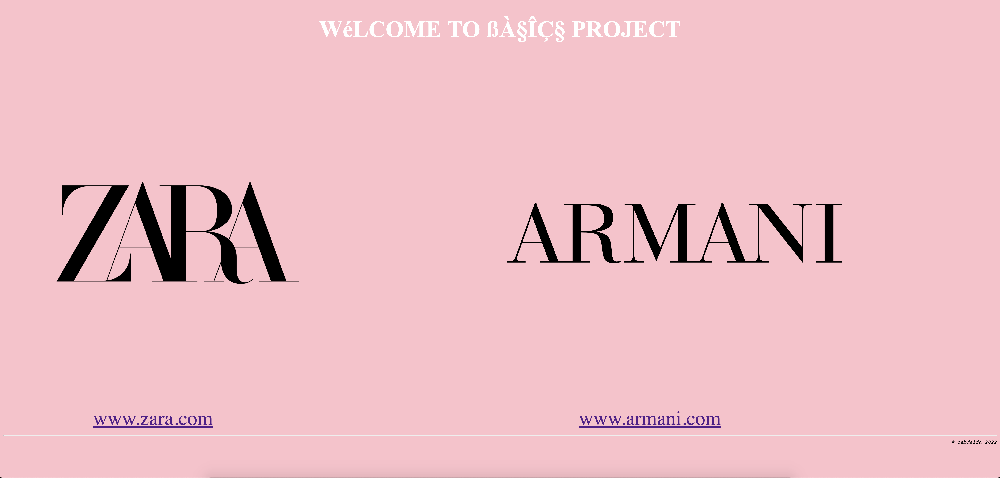
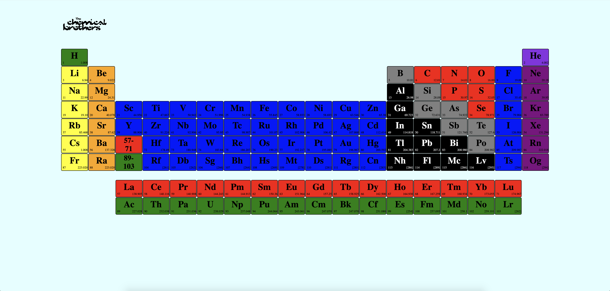
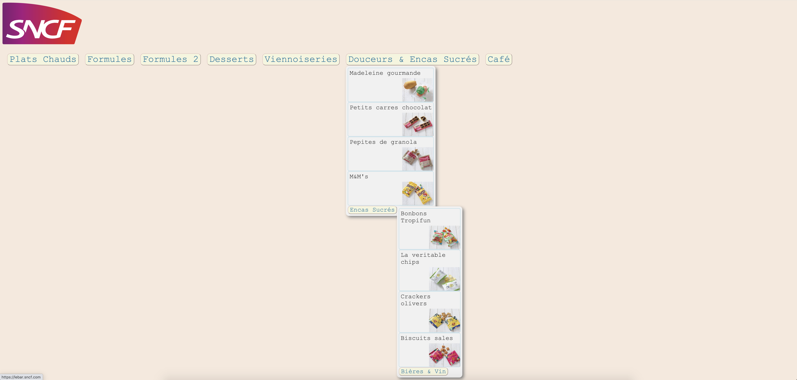
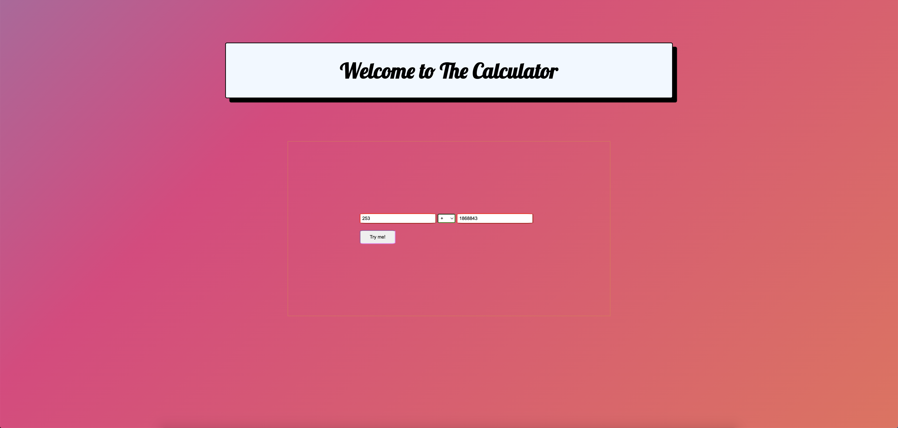
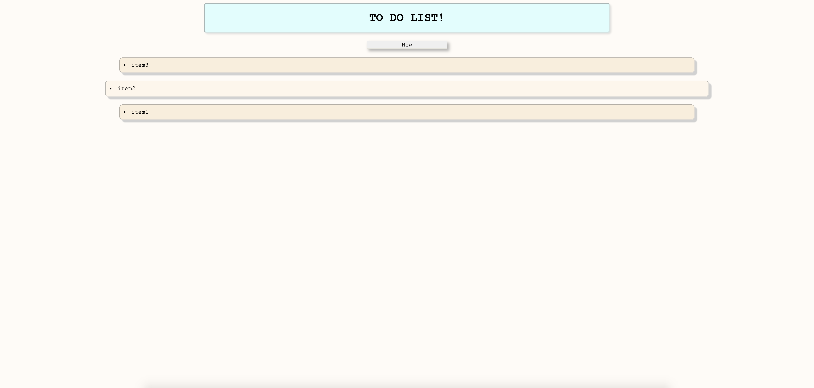

# php-piscine
php-piscine/Hive Helsinki

## :diamond_shape_with_a_dot_inside: **Project's goal:**

This is a bootcamp for 2 weeks, focused mainly on learning PHP and it's elements such as "REGEX, SESSIONS, GET/POST, Cookies, basic functions" and OOP. Additionally we learn HTML, CSS, Javascript JQuery & Ajax to create web applications and finally MYSQL. The idea is to access the basics of frontend and backend creation of websites.

⭐️ DAY00 -> HTML, CSS

⭐️ DAY01 -> PHP BASICS

⭐️ DAY02 -> PHP & REGULAR EXPRESSIONS "REGEX"

⭐️ DAY03 -> PHP GET, COOKIES

⭐️ DAY04 -> PHP POST, SESSIONS

⭐️ DAY05 -> MYSQL

⭐️ DAY06 -> PHP OBJECT ORIENTED PROGRAMMING "OOP"

⭐️ DAY07 -> PHP OBJECT ORIENTED PROGRAMMING "OOP"

⭐️ DAY08 -> PHP OBJECT ORIENTED PROGRAMMING "OOP"

⭐️ DAY09 -> JAVASCRIPT, JQUERY, AJAX

## :warning: **NOTE:**

Days like day 08 and the rush projects which were on the weekends I have decided not to attend them.

## :high_brightness: **SOME WEB RESULTS**

**⭐️ DAY00:**

:arrow_right: EX00:

:arrow_right: EX01/03:

:arrow_right: EX02/05:

:arrow_right: EX04:

**⭐️ DAY09:**

:arrow_right: EX01: 

:arrow_right: EX02: 

